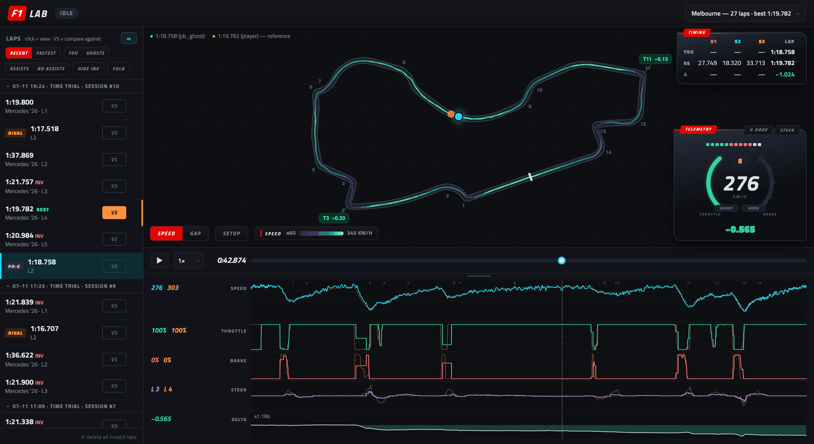
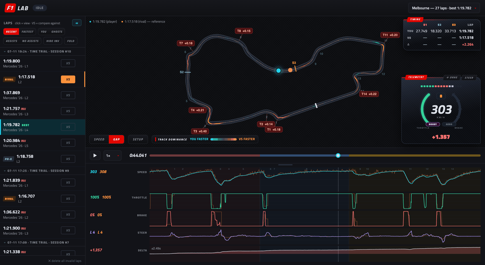
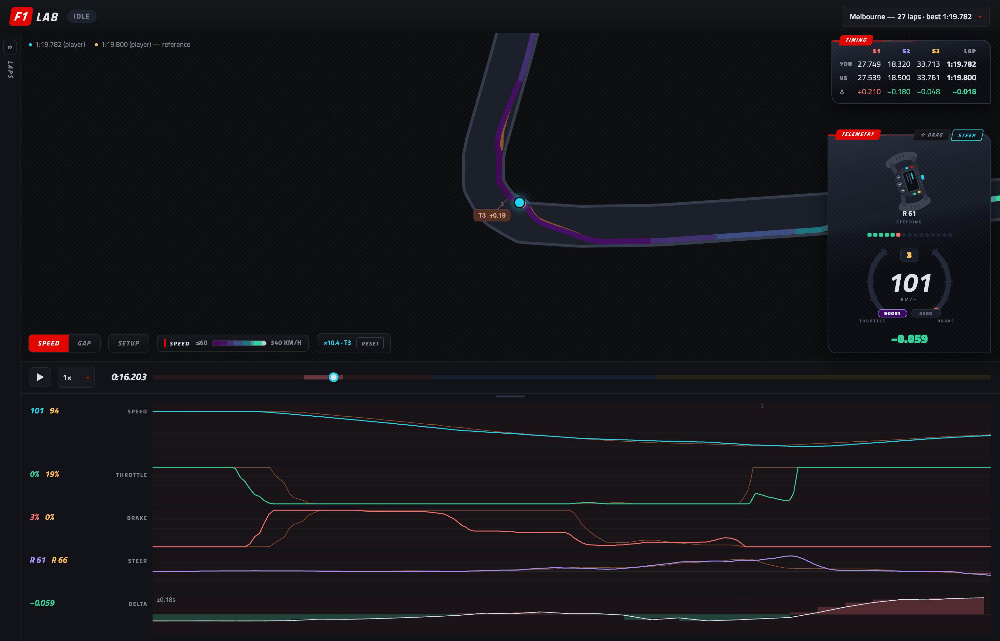
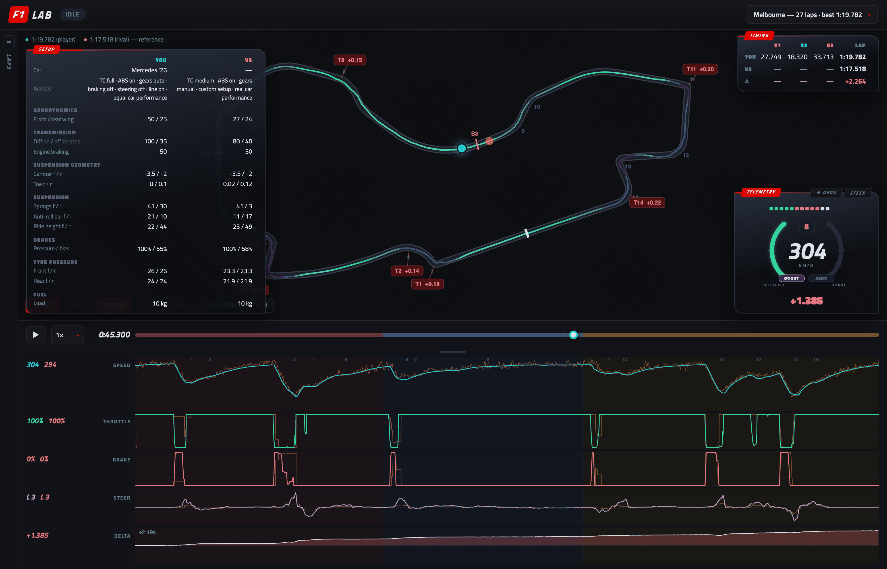

# F1 Lab — Racing Sim Telemetry Workbench for F1 25

F1 Lab records your laps in **F1 25, the EA / Codemasters racing game**,
for the 2026 Season Pack. The game broadcasts live telemetry
while you drive; F1 Lab captures every completed lap — yours and the Time
Trial ghosts' — keeps them across sessions, and lets you replay and compare
any two: track map, dashboard, input traces, time delta, and a badge on
every corner that costs you time. The point is to show where a faster lap
gains on you: which corners, and whether it's braking or throttle.

*Unofficial fan project — not affiliated with Formula 1 or EA/Codemasters.*


*Your PB ghost vs today's best lap: racing line colored by speed, a badge
on every corner where the PB gains 0.1 s or more, input traces and the
time-delta graph.*

## Run

Double-click **`F1 Lab.bat`** (Windows) or **`F1 Lab.command`** (Mac).
The viewer opens in your browser by itself; close the terminal window
when you're done and F1 Lab stops with it.

So far this is only tested on macOS — the Windows launcher hasn't been
tried yet. If it misbehaves, `python -m f1lab` from a terminal is the
fallback.

On a Mac the first double-click may be blocked if you downloaded the
project as a zip — right-click the file and choose **Open** once.

Or from a terminal:

```bash
python3 -m f1lab
```

Nothing to install: any Python 3 will do — it's standard library only.

- Recorder listens on UDP **20777**
- Viewer at **http://localhost:8020**
- Data stored in `data/f1lab.db` (SQLite)

Options: `--udp-port`, `--http-port`, `--db`, `--no-browser`.

To look around before hooking up the game, `python3 -m f1lab --demo`
serves two bundled Melbourne laps, opened as a ready-made comparison.
Demo mode records nothing and leaves your own lap database untouched.

## Game settings (on the PC running the game)

`Settings → Telemetry`:

| Setting | Value |
| --- | --- |
| UDP Telemetry | On |
| UDP Broadcast Mode | Off |
| UDP IP Address | this machine's LAN IP (printed at startup) |
| UDP Port | 20777 |
| UDP Send Rate | 60 Hz |
| UDP Format | **F1 25: 2026 Season Pack** (2025 base format also supported) |

Then just drive. Every completed lap is stored automatically — yours **and the
Time Trial ghosts'**.

### How you know it's working

The chip next to the logo in the viewer header tells you whether telemetry
is arriving:

| Chip | Meaning |
| --- | --- |
| `LIVE … pps` | receiving — the number is packets per second, and the track / session / live lap time show next to it |
| `IDLE` | listening but nothing arriving. Normal in menus (the game only broadcasts on track); if it stays IDLE while you drive, re-check the IP address and port above |
| `OFFLINE` | no recorder — usually another f1lab instance already holds the UDP port |

Load into a session and the chip should flip to `LIVE` within a couple of
seconds. In Time Trial a second chip shows the ghost situation
(`RIVAL GHOST ✓` etc. — see below).

## Ghost laps: your PB and any leaderboard entry

In Time Trial the game broadcasts full telemetry for the ghosts on track,
and the recorder stores their laps alongside yours: your personal-best
ghost as `PB·G`, the rival ghost as `RIVAL`. Load any leaderboard entry as
the rival — a friend, the top 10, the world record — and you get that
driver's complete lap (position, speed, throttle, brake, steering) to
compare against. No exports or downloads needed.

**Keep the ghost car enabled** — a disabled shadow car is not broadcast at
all. While driving, the header shows `RIVAL GHOST ✓` when ghost telemetry is
actually coming in, so you know before wasting a session.

## Browsing and comparing laps

Everything the recorder has stored is on the web page it serves at
`http://localhost:8020`:

- Pick a **track** in the header dropdown: every lap you ever recorded on it,
  from all sessions, in one list (grouped by session). Sort **RECENT** or
  **FASTEST** (ranked, with gaps), filter YOU / GHOSTS and assists on/off,
  hide invalid laps.
- **SETUP** shows the viewed lap's car setup and assist settings (TC, ABS,
  gearbox, racing line…) — side by side with the reference lap's.
- Click a lap to replay it: dot on the track map + instrument cluster
  (speed, gear, throttle/brake arcs, rev lights, steering wheel, DRS/OT).
- Mark any other lap as **VS** — from any session, any day: ghost dot,
  overlaid speed / throttle / brake / steering traces, and a **DELTA** graph
  vs distance — green where you gain time on the reference, red where you
  lose it.
- Next to each chart: the **values at the playhead**, both laps side by
  side — the mid-corner speed difference as a number, not just a gap
  between curves.
- **Corner badges** on the map show every corner where you gain or lose
  0.1 s or more vs the reference. Time is attributed braking-point to
  braking-point, so a slow exit is charged to the corner that caused it and
  the badges account for the whole gap.
- **Scroll on the map to zoom into a corner** (drag to pan, double-click or
  RESET to fit): every chart re-scales to that stretch of track so you can
  study braking points in detail.
- Space = play/pause, ←/→ = seek 1 s (Shift = 5 s), click charts or map to seek.


*GAP mode — track dominance: cyan where you're faster than the reference,
orange where the reference is faster.*


*Zoomed ×10 into one corner, lap tray collapsed to a rail: two nearly
identical laps, but the braking traces show exactly where the reference
brakes later.*


*SETUP — the viewed lap's car setup and assists next to the reference
lap's, so a time difference can be traced to the car, not just the
driving.*

## Track maps

Laps recorded from the game are drawn from the car's **real world
coordinates** — the map is exactly what you drove. For laps without position
data (e.g. imports), the viewer falls back to bundled **real circuit
outlines** for every 2026-calendar track including Madrid
(`f1lab/static/tracks.json`, built from the
[f1-circuits](https://github.com/bacinger/f1-circuits) dataset via
`tools/build_tracks.py`; such maps are labelled "approx.").

## Testing without the game

```bash
python3 tools/fake_game.py --speedup 40
```

Replays the Spa lap from `tools/spa-lap.md` (player + rival ghost) as real
2026-format UDP packets against the recorder.

## Layout

```
f1lab/packets.py    packet structs (2025 + 2026 formats, header-switched)
f1lab/recorder.py   UDP listener, lap segmentation, ghost capture, flashback handling
f1lab/db.py         SQLite schema; per-lap compressed column blobs
f1lab/server.py     JSON API + static viewer
f1lab/static/       single-page viewer (no build step)
tools/fake_game.py  synthetic game for end-to-end testing
```

## Documentation

- [docs/architecture.md](docs/architecture.md) — how the pieces fit:
  threads, recording pipeline, storage, HTTP API, viewer subsystems.
- [docs/design-notes.md](docs/design-notes.md) — decisions and the game
  quirks behind them: ghost telemetry placeholders and the trust table,
  the recorder's rule budget, per-corner time attribution, color system.

## License

[AGPL-3.0](LICENSE). Bundled [Titillium Web](https://fonts.google.com/specimen/Titillium+Web)
fonts are licensed under the [SIL Open Font License 1.1](f1lab/static/fonts/OFL.txt).
Not affiliated with Formula 1 or EA/Codemasters.
